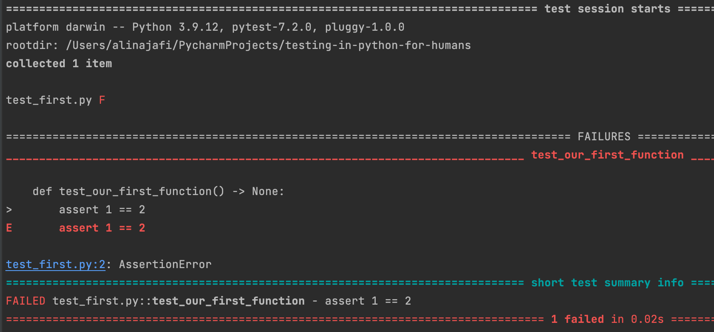
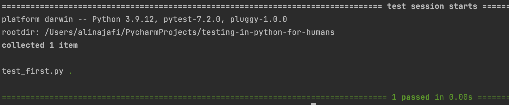
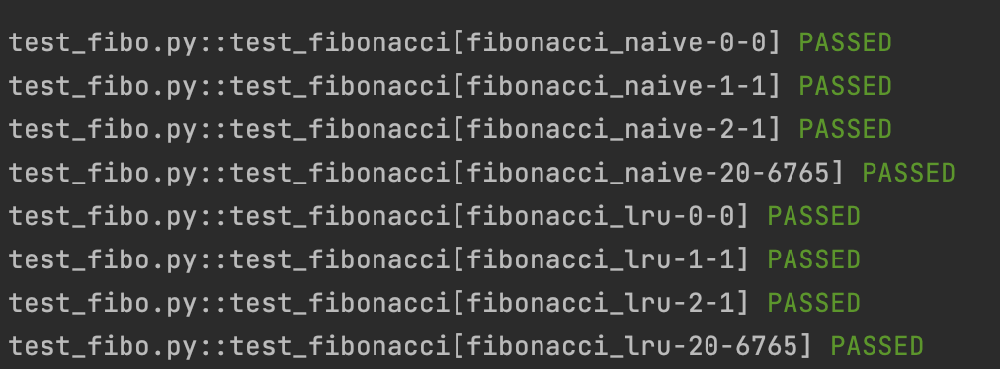

<div dir="rtl" align="center">

# تست‌نویسی در Pytest برای آدمیزاد !

</div>

<div dir="rtl" align="right">

پای‌تست معروف ترین و محبوب ترین کتابخونه تست‌نویسی پایتون هست که توی این صفحه میخوام با کمک گرفتن از چندین منبع به زبون
آدمی زاد اون رو بهتون یاد بدم!

## ویژگی های اصلی

- پلاگین بیس هست! (یک عالمه پلاگین وجود داره که میتونیم به راحتی روی PyTest نصب کنیم)
- UnitTest نیست! (جلوتر میگم چرا)
- راهکار های جدیدش در نحوه تست‌نویسی، باعث شده شما فقط روی منطق تمرکز کنید نه در نحوه نوشتن!

به این تیکه کد نگاه کنید:

</div>

<div dir="ltr" align="left">

```python

def test_create_company_without_arguments_should_fail(client) -> None:
    response = client.post(path=companies_url)
    assert response.status_code == 400
    assert json.loads(response.content) == {"name": ["This field is required."]}

```

</div>

<div dir="rtl" align="right">

اگه حتی از Pytest چیزی ندونید و فقط حداقل اطلاعاتی درمورد تست‌نویسی (و مفهوم assert) بدونید، مطمئنن این کد رو متوجه
میشید!

## امکانات Pytest که در آینده باهاشون کار میکنیم!

Fixture 🔸

Custom Marker 🔸

Parametrize 🔸

Skip 🔸

Xfail 🔸

<br>
<br>

<div dir="rtl" align="center">

# شروع کار با Pytest

</div>

اولین نکته اینه که اسم فایل های تست ما باید با test_ شروع و یا تموم بشه!

نکته دوم اینه که Pytest نصب باشه! پس با دستور زیر نصبش میکنیم:

`pip install -U pytest`

حالا فرض کنید توی فایل `test_first.py` کد های زیر رو داریم:

</div>

<div dir="ltr" align="left">

```python
def test_our_first_function() -> None:
    assert 1 == 2
```

</div>
<div dir="rtl" align="right">

برای اجرای تستمون میتونیم توی Terminal یا CMD بنویسیم:


</div>

<div dir="ltr" align="left">

```
pytest .
```

</div>

<div dir="rtl" align="right">

این دستور برای ما همه فایل های تست توی پوشه فعلی رو تست میکنه! که توی این مورد به ما ارور نشون میده چون یک برابر دو
نیست :))



ولی اگه همون کد رو به کد زیر تغییر بدیم:

</div>

<div dir="ltr" align="left">

```python
def test_our_first_function() -> None:
    assert 1 == 1
```

</div>
<div dir="rtl" align="right">


نتیجه اینطوی میشه:



حالا جلوتر توضیح میدیم که چطور میتونید خروجی Pytest رو بهتر کنید و بفهمیدش :) فعلا بزارید فقط باهاش آشنا بشیم.

## بررسی Unit tests و Integration Tests

بزارید با یک مثال شروع کنیم. فرض کنید یک ای پی ای داریم که میخواد چند تا عملیات محاسباتی رو انجام بده و نتیجه رو به ما
برگردونه. توی این سرویس ممکنه دیتا از دیتابیس خونده بشه و شاید هم توی دیتابیس نوشته بشه.

ما توی Unit Tests میایم و بخش های کوچیک منطقی (Backend Logic) کدمون رو تست میکنیم. مثلا توی این مثال اون توابعی که
عملیات محاسبات رو انجام میدن رو تست میکنیم و باید دقت کنیم که این تست باید توی یک محیط ایزونه یا جداشده اتفاق بیفته...
یعنی چی ؟ یعنی دیتای ورودی، لایه API، ارتباط با دیتابیس همشون باید فرض بشه که درست کار میکنن (و حتی رفتارشون رو جعل
کنیم) تا بتونیم مطمئن بشیم دقیقا همین بخشی که تست میکنیم کار خودشو درست انجام میده!
(توی پرانتر بگم که به این جعل کردن، ماک کردن میگیم که بعدا حسابی باهاش کار داریم!)

پس توی Unit Tests ما تست میکنیم که توابع‌مون با یک سری ورودی مشخص، حتما یک سری خروجی مشخص و درست داشته باشن!

ولی توی Integration Tests میایم و چند بخش رو باهم تست میکنیم! مثلا لایه API و لاجیک رو باهم تست میکنیم، یا چند لاجیک رو
همزمان تست میکنیم، یا توی تست هامون دیتابیس رو هم قاطی میکنیم!


<br>
<br>

<div dir="rtl" align="center">

# با یک پروژه واقعی تست‌نویسی رو یاد بگیریم!

</div>


بنظر من بهترین روش برای یادگیری، کار کردن و یاد گرفتن با پروژه های واقعی هست... برای یادگیری تست هم سعی میکنیم با پروژه
های واقعی پیش بریم و اولین پروژه‌مون یک پروژه جنگویی هست! خب شاید بگید میخواید تست‌نویسی با PyTest یاد بگیرید و علاقه ای
به یادگیری جنگو ندارید(!) خب میتونید این بخش راه اندازی جنگویی رو رد کنید و برید بخش دوم این پروژه که مربوط به تست هست
ولی قرار نیست خیلی با جنگو درگیر بشیم... فقط
میخوایم یکم بتونیم ازش برای نوشتن یک پروژه واقعی کمک بگیریم، پس اگه درمورد جنگو اطلاعات دارید، بسیار پیشنهاد میکنم که
این بخش رو ادامه بدید...

همونطور که گفتم باید یک حداقل دیتایی درمورد جنگو داشته باشید! پس من خیلی دستورات و مراحل کار رو توضیح نمیدم... فقط تیتر
وار و خلاصه باهم پیش میریم.

## قسمت ۱: راه‌اندازی پروژه جنگویی

خب در اولین قدم ما پکیج های جنگو و جنگو رست فریمورک رو نصب میکنیم! (اگه بلد
نیستید [اینجا](https://docs.djangoproject.com/en/4.1/topics/install/)
و [اینجا](https://www.django-rest-framework.org/tutorial/quickstart/) رو بخونید!)

بعد از نصب با کمک دستور `django-admin startproject sample_project` یک پروژه میسازیم و بعد از وورد به پوشه پروژه،
دستور `python manage.py runserver` رو میزنیم تا پروژه اجرا بشه! در نتیجه این اتفاق پروژه روی
آدرس `http://localhost:8000` اجرا میشه و میتونید از طریق مرورگرتون بهش دسترسی داشته باشید! (اگه مشکلی داشتید میتونید
از [اینجا](https://docs.djangoproject.com/en/4.1/intro/tutorial01/) راهنمایی بگیرید!)

بعد از اون نیازه با کمک دستور  `python manage.py startapp sample_app` اول یک اپ جدید بسازیم که در نتیجه اون در پوشه
پروژه برای ما یک پوشه با نام `sample_app` ساخته میشه. عبد باید توی فایل settings.py در پوشه پروژه، اپ رو به لیست اپ های
پروژه(installed_apps) اضافه کنیم! (اگه مشکلی داشتید میتونید
از [اینجا](https://docs.djangoproject.com/en/4.1/intro/tutorial02/) راهنمایی بگیرید!)

خب حالا میتونیم بریم توی پوشه sample_app و فایل `models.py` رو باز کنیم و یک مدل بسازیم! مثلا مدلی با نام `SampleModel`
که یک سری فیلد داشته باشه و بعد از اون میتونیم با دستور `python manage.py makemigrations` و `python manage.py migrate`
مدل رو به دیتابیس اضافه کنیم! (اگه مشکلی داشتید میتونید
از [اینجا](https://docs.djangoproject.com/en/4.1/intro/tutorial02/) راهنمایی بگیرید!)

پس کد های فایل model.py میشه:


</div>

<div dir="ltr" align="left">

```python
from django.db import models
from django.db.models import URLField
from django.utils.timezone import now


class Company(models.Model):
    class CompanyStatus(models.TextChoices):
        LAYOFFS = "Layoffs"
        HIRING_FREEZE = "Hiring Freeze"
        HIRING = "Hiring"

    name = models.CharField(max_length=30, unique=True)
    status = models.CharField(
        choices=CompanyStatus.choices, default=CompanyStatus.HIRING, max_length=30
    )
    last_update = models.DateTimeField(default=now, editable=True)
    application_link = URLField(blank=True)
    notes = models.CharField(max_length=100, blank=True)

    def __str__(self) -> str:
        return f"{self.name}"
```

</div>
<div dir="rtl" align="right">


در مرحله بعد نیاز داریم که سریالایزر بسازیم پس فایل `serializers.py`مون به این صورت میشه:


</div>

<div dir="ltr" align="left">

```python

from rest_franework import serializers
from .models import Company


class CompanySerializer(serializers.ModelSerializer):
    class Meta:
        model = Company
        fields = ["¡d" "status", "application_Link", "last_update", "notes"

```

</div>
<div dir="rtl" align="right">

در مرحله بعد هم از ModelViewSet استفاده میکنیم تا راحت API های Add, Edit, View , List , Delete رو برامون ایجاد کنه :)

پس فایل `views.py`مون به این صورت میشه:

</div>

<div dir="ltr" align="left">

```python

class CompanyViewSet(ModelVievSet):
    serializer_class = CompanySerializer
    queryset = Company.objects.all().order_by("-last_update")
```

</div>


<div dir="rtl" align="right">
حالا در مرحله بعد مدل‌مون رو به پنل ادمین اضافه میکنیم. پس توی فایل admin.py:
</div>

<div dir="ltr" align="left">

```python
from django.contrib import admin

from api.coronavstech.companies.models import Company


@admin.register(Company)
class CompanyAdmin(admin.ModelAdmin):
    pass

```

</div>


<div dir="rtl" align="right">

به عنوان آخرین مرحله هم فایل `urls.py` اپ‌مون به این صورت میشه:

</div>

<div dir="ltr" align="left">

```python
from rest_franework import routers
from views import CompanyiewSet

companies_router = routers.DefaultRouter()
companiesـrouter.register("companies", vievset=CompanyViewSet, basename="companies")

```

</div>

<div dir="rtl" align="right">
و فایل `urls.py` در پوشه اصلی پروژه به این صورت میشه:
</div>
<div dir="ltr" align="left">

```python
from django.contrib import adnin
from django.urls import path, include
from companies.urls import companies_router

urtpatterns = [
    path("admin/", admin.site.urls),
    path("", include(companies_router.urls))
]
```

</div>

<div dir="rtl" align="right">

## قسمت ۲: شروع تست‌نویسی

بیاین اول یک نگاه کوچیک بکنیم به اینکه اگه پای‌تست نباشه و بخوایم با unittest تست بنویسیم، چطوری باید تست بنویسیم؟

</div>

<div dir="ltr" align="left">

```python
from django.urls import reverse
from django.test import Client
from unittest import TestCase


class TestGetCompanies(TestCase):
    def setUp(self) -> None:
        self.client = Client()
        self.companies_url = reverse("companies-list")

    def tearDown(self) -> None:
        pass

    def test_zero_companies_should_return_empty_list(self) -> None:
        response = self.client.get(self.companies_url)
        self.assertEqual(response.status_code, 200)
        self.assertEqual(json.loads(response.content), [])
```

</div>


<div dir="rtl" align="right">

خب یکم زشته نه؟ اولا که نیاز در قابل یک کلاس تست بنویسیم! دوم نیاز به setUp و tearDown داریم! برای مقایسه هم باید عبارت
طولانی مثل self.assertEqual رو اونم بصورت یک تابع بنویسید! خب من به شخصه اصلا خوشم نیومد!

</div>

<div dir="ltr" align="left">

```python
import pytest
from django.urls import reverse

companies_url = reverse("companies-list")


@pytest.mark.django_db
def test_zero_companies_should_return_empty_list(client) -> None:
    response = client.get(companies_url)
    assert response.status_code == 200
    assert json.loads(response.content) == []

```

</div>

<div dir="rtl" align="right">

به همین جذابی! حتی client رو هم خودش برامون ساخت! (با کمک پلاگین pytest-django)

دکمه دیگه اینکه با یک assert ساده میتونیم از عملگر های پایتون (مثل برابر، کمتر و بیشتر) استفاده کنیم!

خب حالا که فهمیدید چی به چیه بریم باهم استارت بزنیم!

### نصب pytest-django

اول با دستور پایین نصبش میکنیم:


</div>

<div dir="ltr" align="left">

```
pip install pytest-django
```

</div>

<div dir="rtl" align="right">

بعد توی فایل `pytest.ini` که توی روت پروژه باید ایجاد بشه، این خط رو اضافه میکنیم(ProjectName اسم پوشه ای هست که setting
ما درونش هست):

</div>

<div dir="ltr" align="left">

```
[pytest]
DJANGO_SETTINGS_MODULE = ProjectName.settings
```

</div>

<div dir="rtl" align="right">

حالا میتونیم با دستور `pytest` تست ها رو اجرا کنیم!

### تست های مختلف برای پروژه‌امون بنویسیم!

خب اولین تستی که برای مثال نوشتیم رو یادتونه ؟

</div>


<div dir="ltr" align="left">

```python
import pytest
from django.urls import reverse

companies_url = reverse("companies-list")


@pytest.mark.django_db
def test_zero_companies_should_return_empty_list(client) -> None:
    response = client.get(companies_url)
    assert response.status_code == 200
    assert json.loads(response.content) == []

```

</div>


<div dir="rtl" align="right">

خب این تست یک تست هست که بررسی میکنه اگر هیچ کمپانی در دیتابیس نباشه ای پی ای ما، لیست خالی برگردونه!
اولین نکته اینه که companies-list به این علت هست که ما وقتی از Viewset استفاده میکنیم مقدار url_name رو به صورت
`[model_name]-list` میذاریم. این مقدار رو میتونید از داکیومنت DRF ببینید.
که ادرسش اینجاست: https://www.django-rest-framework.org/api-guide/routers/#simplerouter

نکته دوم اینکه ما از دیتابیس استفاده میکنیم و برای فعال کردن دیتابیس از دکوریتور @pytest.mark.django_db استفاده کردیم که
اول یک دیتابیس تستی کوچولو میسازه و بعد از تست پاک میکنه. این نکته مهمه که این دیتابیس از دیتابیس اصلی پروژمون جدا هست!

نکته سوم اینکه ما از client استفاده کردیم که از پلاگین pytest-django میاد. این کلاینت یک کلاینت تستی هست که میتونه تست
های ما رو اجرا کنه. این کلاینت از کلاس APIClient که از django.test.Client میاد استفاده میکنه.

و آخرین نکته هم اینه که ما از json.loads استفاده کردیم که یک تابعی هست که یک رشته استرینگ بصورت جیسون رو به یک دیکشنری
تبدیل میکنه.

خب حالا برای اینکه تست های ما اجرا بشن، میتونیم از دستور `pytest` استفاده کنیم.

</div>

<div dir="ltr" align="left">

```python
import pytest
from django.urls import reverse

from api.coronavstech.companies.models import Company

companies_url = reverse("companies-list")
pytestmark = pytest.mark.django_db


def test_one_company_exists_should_succeed(client) -> None:
    test_company = Company.objects.create(name="Amazon")
    response = client.get(companies_url)
    response_content = json.loads(response.content)[0]
    assert response.status_code == 200
    assert response_content.get("name") == test_company.name
    assert response_content.get("status") == "Hiring"
    assert response_content.get("application_link") == ""
    assert response_content.get("notes") == ""

```

</div>

<div dir="rtl" align="right">

خب این تست هم مشابه تست قبلیه. تفاوتش اینه که این تست یک کمپانی رو در دیتابیس میسازه و بعد از اجرای تست، این کمپانی رو
پاک میکنه.

خب پس بر پایه این تست یاد گرفتیم که میتونیم یک ابجکت رو با ORM بسازیم و بعدش ای پی ای رو تست کنیم!

تنها نکته این تست اینه که بجای دکوریتور از `pytestmark = pytest.mark.django_db` استفاده کردیم! این کد میگه این دکوریتور
رو به همه تستایی که توی این صفحه هستن اضافه کن! پس کارمون یک پله راحت تر شد!


<br>
<br>

حالا میخوایم تست هایی که مربوط به ساخت یک کمپانی هست رو بنویسیم... دیگه نمیام جداشون کنم همه رو یکجا ببینید :)

</div>

<div dir="ltr" align="left">

```python
def test_create_company_without_arguments_should_fail(client) -> None:
    response = client.post(path=companies_url)
    assert response.status_code == 400
    assert json.loads(response.content) == {"name": ["This field is required."]}


def test_create_existing_company_should_fail(client) -> None:
    Company.objects.create(name="apple")
    response = client.post(path=companies_url, data={"name": "apple"})
    assert response.status_code == 400
    assert json.loads(response.content) == {
        "name": ["company with this name already exists."]
    }


def test_create_company_with_only_name_all_fields_should_be_default(client) -> None:
    response = client.post(path=companies_url, data={"name": "test company name"})
    assert response.status_code == 201
    response_content = response.json()
    assert response_content.get("name") == "test company name"
    assert response_content.get("status") == "Hiring"
    assert response_content.get("application_link") == ""
    assert response_content.get("notes") == ""


def test_create_company_with_layoffs_status_should_succeed(client) -> None:
    response = client.post(
        path=companies_url,
        data={"name": "test company name", "status": "Layoffs"},
    )
    assert response.status_code == 201
    response_content = json.loads(response.content)
    assert response_content.get("status") == "Layoffs"


def test_create_company_with_wrong_status_should_fail(client) -> None:
    response = client.post(
        path=companies_url,
        data={"name": "test company name", "status": "WrongStatus"},
    )
    assert response.status_code == 400
    assert "WrongStatus" in str(response.content)
    assert "is not a valid choice" in str(response.content)

```

</div>


<div dir="rtl" align="right">
بنظرم همشون مشابه قبلیا هستن و فقط با خوندشون میتونید یاد بگیرید که چطوری یک ابجکت رو با ای پی ای بسازید و چطوری
تست کنید که این ابجکت درست ساخته شده یا نه!

حواستون باشه که باید شرایط خاص مثل اینکه نمیتونیم چند کمپانی با یک اسم داشته باشیم و یا مقدار خالی برای ساخت کمپانی
اشتباهه رو تست کنید(مثل نمونه!)

اگر مشکلی داشتید میتونید از من بپرسید! (issue یا alinajafi321@gmail.com)

# یادگرفتن Parametrize با طعم فیبوناچی

خب احتمالا با مساله معروف فیبوناچی آشنا هستید! این مساله یک مساله ریاضیه که این مقادیر رو بر میگردونه:

0, 1, 1, 2, 3, 5, 8, 13, 21, 34, 55, 89,144,233,377,610,987,...

اگه نمیدونید چیه و چطوری حساب میشه اینجا ببینید:

https://en.wikipedia.org/wiki/Fibonacci_number

خب اول بیاید به ساده ترین روشش که بازگشتی هست نگاه کنیم:

</div>
<div dir="ltr" align="left">

```python
def fibonacci_naive(n: int) -> int:
    if (n == 0) or (n == 1):
        return n
    return fibonacci_naive(n - 2) + fibonacci_naive(n - 1)
```

</div>

<div dir="rtl" align="right">

حالا اگه بخوایم براش تست بنویسیم به این صورت باید عمل کنیم:

</div>

<div dir="ltr" align="left">

```python
def test_naive() -> None:
    res = fibonacci_naive(n=0)
    assert res == 0

    res = fibonacci_naive(n=1)
    assert res == 1

    res = fibonacci_naive(n=2)
    assert res == 1

    res = fibonacci_naive(n=21)
    assert res == 6765
```

</div>

<div dir="rtl" align="right">

این یک تست خوبه ولی تکرار کد توش خیلی به چشم میاد، قبول دارین؟

برای حل این مشکل میتونیم از یک تکنیک به نام Parameterized Test استفاده کنیم.

این تکنیک یک تکنیکیه که میتونیم با استفاده از `@pytest.mark.parametrize` بجای اینکه یک تکه کد رو برای مقادیر مختلف کپی
کنیم، یک تابع رو چندین بار با مقادیر مختلف اجرا کنیم!

به این نمونه توجه کنید:

</div>

<div dir="ltr" align="left">

```python
@pytest.mark.parametrize("n, expected", [(0, 0), (1, 1), (2, 1), (20, 6765)])
def test_naive(n: int, expected: int) -> None:
    res = fibonacci_naive(n=n)
    assert res == expected
```

</div>

<div dir="rtl" align="right">

مقدار اول هر مجموعه همون مقدار `n` هست و مقدار دوم هر مجموعه `expected` هست که به عنوان ورودی تابع تستمون میاد!

خب بیاین فرض کنید ما دو تا تابع برای محاسبه فیبوناچی داریم، مثلا میخوایم یک تابع قابلیت کش کردن با lru هم داشته باشه!

اول بیاین اون تابع رو بنویسیم:

</div>

<div dir="ltr" align="left">

```python

@lru_cache(maxsize=1024)
def fibonacci_lru(n: int) -> int:
    if (n == 0) or (n == 1):
        return n
    return fibonacci_lru(n - 2) + fibonacci_lru(n - 1)

```

</div>

<div dir="rtl" align="right">


حالا بیاین تست بنویسیم و در قالب یک تست هم فیبو ناچی ساده رو تست کنیم هم فیبوناچی با کش رو:

</div>

<div dir="ltr" align="left">

```python
@pytest.mark.parametrize("n, expected", [(0, 0), (1, 1), (2, 1), (20, 6765)])
@pytest.mark.parametrize("fib_function", [fibonacci_naive, fibonacci_lru])
def test_fibonacci(fib_function: Callable[[int], int], n: int, expected: int) -> None:
    res = fib_function(n)
    assert res == expected
```                         

</div>

<div dir="rtl" align="right">


بیاین خروجی باحالش رو با کمک `pytest -v` ببینیم(-v کمک میکنه تا خروجی کامل تری ببینیم):



خب اینجا میبینیم که تست های ما با موفقیت اجرا شدن و همچنین میبینیم که تست های ما با کش هم اجرا شدن و با کش هم موفقیت
آمیز بودن!

</div>